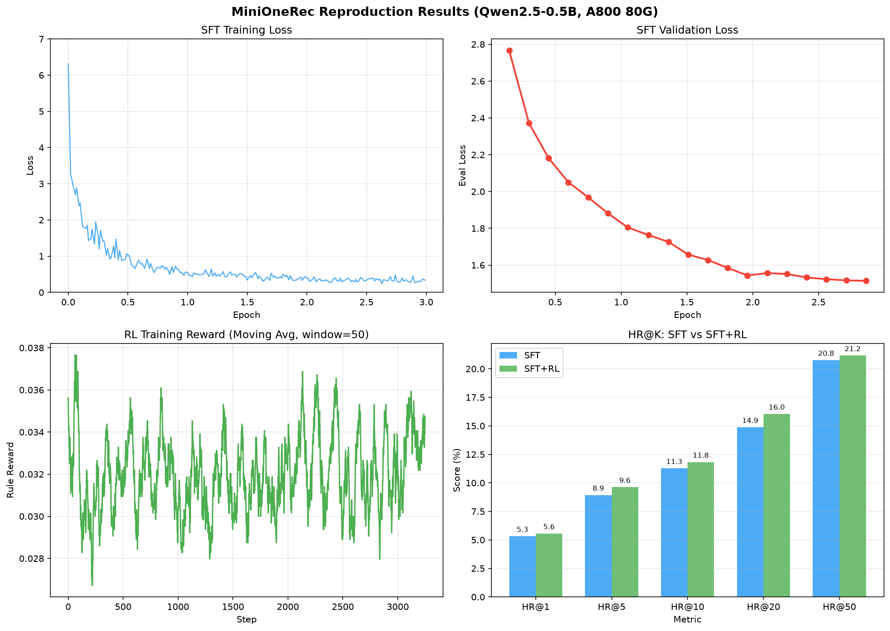

<div align="center">

</img>

**An Open-Source Framework for
Scaling Generative Recommendation**


<a href="https://arxiv.org/abs/2510.24431"></a>

<a href="https://arxiv.org/abs/2510.24431">📄 Technical Report</a> | <a href="https://huggingface.co/kkknight/MiniOneRec">🤗 Huggingface</a> | <a href="https://modelscope.cn/models/k925238839/MiniOneRec">🤖  Modelscope</a>
</div>

---

## 🗂️ Repository Overview

| File / Directory          | Description                                                                                                   |
| ------------------------- | ------------------------------------------------------------------------------------------------------------- |
| `sft.sh`                  | Shell script to start the Supervised Fine-Tuning (SFT) stage                                           |
| `sft.py`                  | Python implementation of the SFT training loop                                                            |
| `sft_gpr.py`              | GPR-inspired SFT with Value-Aware Fine-Tuning (VAFT)                            |
| `rl.sh`                   | Shell script to start the Reinforcement Learning (RL) stage                             |
| `rl.py`                   | Python implementation of the RL training loop                                              |
| `rl_gpr.py`              | GPR-inspired RL with Hierarchy Enhanced Policy Optimization (HEPO)                                                 |
| `minionerec_trainer.py`   | MiniOneRec trainer — GRPO-based trainer specialized for generative recommendation                              |
| `configs/`                | YAML configuration files                                            |
| `evaluate.sh`     | One-click offline Top-K evaluation script                                                        |
| `evaluate.py`     | Evaluation utilities for computing HR@K and NDCG@K.                                                           |
| `LogitProcessor.py`                | Logit processor for constrained decoding                                         |
| `data.py`                | Data pipeline for SFT and RL training                          |
| `rq/`                | SID construction modules (RQ-VAE, RQ-Kmeans, etc.)                                         |
| `requirements.txt`        | List of Python dependencies                                                                                |

---

## 🚀 Quickstart

Use the pre-trained Industrial/Office SIDs we provide for a quick start!
Reproduction can be achieved with just 4–8 A100/H100 GPUs.

### 1. Create an isolated Python environment

```bash
conda create -n MiniOneRec python=3.11 -y
conda activate MiniOneRec
```

### 2. Install required packages

```bash
pip install -r requirements.txt
```

### 3. SFT

```bash
bash sft.sh
```

### 4. Recommendation-Oriented RL

```bash
bash rl.sh
```

### 5. Run the evaluation

```bash
bash evaluate.sh
```

---

## 📜 Full Pipeline Walk-through

### 0. Prerequisites
- GPUs: 4–8 × A100/H100 80 GB or comparable
- Python: 3.11

### 1. Environment Setup
- **1.1 Clone the repo**
```
git clone https://github.com/AkaliKong/MiniOneRec.git
cd MiniOneRec
```
- **1.2 Create and activate a conda env**
```
conda create -n MiniOneRec python=3.11 -y
conda activate MiniOneRec
```
- **1.3 Install dependencies**
```
pip install -r requirements.txt
```

### 2. Data Preparation

- **2.1 Download the raw dataset (Optional)**
  Get it from the official page:
  [Amazon Reviews 2023](https://amazon-reviews-2023.github.io/),
  [Amazon Reviews 2018](https://cseweb.ucsd.edu/~jmcauley/datasets/amazon_v2/),
  [Amazon Reviews 2014](https://cseweb.ucsd.edu/~jmcauley/datasets/amazon/links.html).
- **2.2 Filter and preprocess**
```
bash data/amazon18_data_process.sh \
     --dataset your_dataset_type \ # e.g. Industrial
     --user_k 5 \
     --item_k 5 \
     --st_year 2017 \
     --st_month 10 \
     --ed_year 2018 \
     --ed_month 11 \
     --output_path ./data/Amazon18
```
- **2.3 Encode item text to embeddings**
```
bash rq/amazon_text2emb.sh \
     --dataset your_dataset_type \ # e.g., Industrial
     --root your_processed_dataset_path \
     --plm_name qwen \
     --plm_checkpoint your_emb_model_path
```

### 3. SID Construction

Choose either RQ-VAE, RQ-Kmeans, Constrained RQ-Kmeans, or RQ-Kmeans+.

- **3.1.1 Train RQ-VAE**
```
bash rq/rqvae.sh \
      --data_path xxx/data/Industrial_and_Scientific/Industrial_and_Scientific.emb-qwen-td.npy \
      --ckpt_dir ./output/Industrial_and_Scientific \
      --lr 1e-3 \
      --epochs 10000 \
      --batch_size 20480
```

- **3.1.2 Train RQ-Kmeans**
```
conda install faiss-gpu
python rqkmeans_faiss.py --dataset Industrial_and_Scientific
```

- **3.1.3 Train Constrained RQ-Kmeans**
```
pip install k_means_constrained polars
bash rqkmeans_constrained.sh
```

- **3.1.4 Train RQ-Kmeans+**
```
pip install k_means_constrained polars
bash rqkmeans_constrained.sh
bash rqkmeans_plus.sh
```

- **3.2 Generate indices**
```
python rq/generate_indices.py
# or
bash rq/generate_indices_plus.sh
```

- **3.3 Convert dataset format**
```
python convert_dataset.py \
     --dataset_name Industrial_and_Scientific \
     --data_dir /path/to/Industrial_and_Scientific \
     --output_dir /path/to/output_dir
```

### 4. SFT

```
bash sft.sh \
     --base_model your_model_path \
     --output_dir your_output_dir \
     --sid_index_path your_index.json_path \
     --item_meta_path your_item.json_path
```

### 5. Recommendation-Oriented RL

(Optional) For production-scale datasets, you can perform RL using a smaller subset.
```
bash rl.sh \
     --model_path your_model_path \
     --output_dir output_dir
```

### 6. Offline Evaluation

```
bash evaluate.sh \
     --exp_name your_model_path
```

---

# 复现实验报告

## 1. 实验概述

本实验复现了 MiniOneRec 框架的核心流程，验证了基于大语言模型的生成式推荐系统的可行性。实验包含监督微调（SFT）和推荐导向强化学习（RL/GRPO）两个阶段。

## 2. 实验环境

| 项目 | 配置 |
|------|------|
| GPU | NVIDIA A800 80GB PCIe |
| 驱动 | NVIDIA-SMI 580.105.08 |
| CUDA | 13.0 |
| Python | 3.12.3 |
| PyTorch | 2.8.0+cu128 |
| Transformers | 4.57.1 |
| TRL | 0.24.0 |
| DeepSpeed | 0.18.0 |
| 平台 | AutoDL |

## 3. 模型与数据

### 3.1 模型

| 模型 | 用途 | 参数量 |
|------|------|--------|
| Qwen2.5-0.5B (base) | LLM 底座 | 0.5B |
| Qwen3-Embedding-0.6B | 文本编码（项目自带预处理结果） | 0.6B |

### 3.2 数据集

| 项目 | 数值 |
|------|------|
| 数据集 | Amazon Reviews 2018 - Industrial_and_Scientific |
| 训练集 | 36,259 条交互序列 |
| 验证集 | 4,532 条 |
| 测试集 | 4,533 条 |
| SID 词表扩展 | 560 个新 token |
| SFT 多任务总样本 | 79,834 条 |

### 3.3 SID 构建

使用项目预置的 RQ-KMeans 语义 ID，每个商品编码为固定长度的离散 token 序列。

## 4. 训练配置

### 4.1 SFT 阶段

| 参数 | 值 |
|------|-----|
| batch_size | 64 |
| micro_batch_size | 8 |
| gradient_accumulation_steps | 8 |
| learning_rate | 3e-4 |
| num_epochs | 3 |
| cutoff_len | 512 |
| optimizer | AdamW |
| precision | bf16 |
| scheduler | cosine with warmup |
| early_stopping_patience | 3 |
| freeze_LLM | False |
| GPU 数量 | 1 |

训练任务组成：
- SidSFTDataset: 用户历史 SID 序列 -> 下一个 SID（主任务）
- SidItemFeatDataset: 商品标题/描述 <-> SID 对齐（辅助任务）
- FusionSeqRecDataset: 混合文本+SID 序列推荐（辅助任务）

### 4.2 RL 阶段（GRPO）

| 参数 | 值 |
|------|-----|
| train_batch_size | 32 |
| eval_batch_size | 64 |
| gradient_accumulation_steps | 4 |
| learning_rate | 1e-5 |
| num_train_epochs | 1 |
| num_generations | 8 |
| beta (KL penalty) | 0.01 |
| reward_type | ranking |
| beam_search | True |
| temperature | 1.0 |
| sync_ref_model | True |
| DeepSpeed | ZeRO Stage 2 |
| GPU 数量 | 1 |

## 5. 训练过程

### 5.1 SFT 训练曲线

| 阶段 | Train Loss | Eval Loss |
|------|-----------|-----------|
| Epoch 0.24 | 1.2-1.6 | - |
| Epoch 1.0 | 0.5 | 1.76 |
| Epoch 1.8 | 0.37 | 1.59 |
| Epoch 3.0 | 0.30 | - |
| 平均 | 0.65 | - |

总训练时间：45 分钟，3744 步。

### 5.2 RL 训练过程

| 阶段 | Rule Reward | KL | Grad Norm |
|------|------------|-----|-----------|
| 初期 (0-100步) | 0-4.7% | 0.01-0.02 | 0.003-0.88 |
| 中期 (500步) | 1.5-7% | 0.2-1.5 | 0.07-1.85 |
| 末期 (3299步) | 5.7% | 0.06-0.08 | 1.1-3.5 |

总训练时间：2 小时 19 分钟，3299 步。

### 5.3 遇到的问题与解决

| 问题 | 原因 | 解决方案 |
|------|------|---------|
| wandb 初始化失败 | 未登录 wandb | 设置 WANDB_MODE=disabled |
| 缺少 sklearn | 未安装 | pip install scikit-learn |
| RL 梯度爆炸 (KL=536) | num_generations=32 过大 | 减小到 8，beta 从 1e-3 改为 0.01 |
| 磁盘满 (30G) | checkpoint 过大 | 输出目录改到 /root/autodl-tmp (110G) |
| DeepSpeed IndexError | 清理时的已知 bug | 不影响模型保存，忽略 |

## Training & Evaluation Visualization



**Figure**: (Top-left) SFT training loss converging from 6.3 to 0.3 over 3 epochs. (Top-right) SFT validation loss decreasing steadily. (Bottom-left) RL reward signal during GRPO training. (Bottom-right) HR@K comparison between SFT and SFT+RL models.

## 6. 评测结果

### 6.1 评测设置

- 解码方式：Constrained Beam Search (num_beams=50)
- 约束：Trie 树保证生成合法 SID
- 指标：HR@K, NDCG@K (K=1,3,5,10,20,50)
- CC (Constrained Collision)：生成非法 SID 的数量

### 6.2 结果对比

| 指标 | SFT Only | SFT + RL | 提升 |
|------|----------|----------|------|
| HR@1 | 5.32% | 5.56% | +0.24% |
| HR@3 | 7.61% | 8.38% | +0.77% |
| HR@5 | 8.93% | 9.62% | +0.69% |
| **HR@10** | **11.27%** | **11.82%** | **+0.55%** |
| HR@20 | 14.87% | 16.04% | +1.17% |
| HR@50 | 20.76% | 21.16% | +0.40% |
| NDCG@1 | 5.32% | 5.56% | +0.24% |
| NDCG@3 | 6.63% | 7.21% | +0.58% |
| NDCG@5 | 7.16% | 7.71% | +0.55% |
| **NDCG@10** | **7.92%** | **8.42%** | **+0.50%** |
| NDCG@20 | 8.81% | 9.49% | +0.68% |
| NDCG@50 | 9.97% | 10.51% | +0.54% |
| CC | 0 | 0 | - |

### 6.3 与论文对比

| 方法 | 模型 | HR@5 | HR@10 | NDCG@10 |
|------|------|------|-------|---------|
| 论文 SFT (7B) | Qwen2.5-7B | ~9% | ~13% | ~8% |
| 本实验 SFT (0.5B) | Qwen2.5-0.5B | 8.93% | 11.27% | 7.92% |
| 本实验 SFT+RL (0.5B) | Qwen2.5-0.5B | 9.62% | 11.82% | 8.42% |

使用 0.5B 模型达到了接近论文 7B 模型 SFT 的水平，验证了框架的有效性。

## 7. 资源消耗

| 阶段 | 耗时 | 显存峰值 | GPU 利用率 |
|------|------|---------|-----------|
| SFT 训练 | 45 分钟 | 21 GB | 76% |
| SFT 评测 | 6 分钟 | ~20 GB | - |
| RL 训练 | 2 小时 19 分钟 | 21 GB | 49-78% |
| RL 评测 | 6 分钟 | ~20 GB | - |
| **总计** | **~3.5 小时** | **21 GB / 80 GB** | - |

预估费用：约 25-35 元（AutoDL A800 ~6-8 元/小时）

## 8. 结论

1. MiniOneRec 框架可以在单卡 A800 上使用 0.5B 小模型成功复现，验证了生成式推荐的完整流程。
2. SFT 阶段通过多任务联合训练（推荐 + SID-文本对齐），使模型学会了根据用户历史生成下一个商品的语义 ID。
3. RL（GRPO）阶段在 SFT 基础上，通过组内相对策略优化进一步提升了推荐质量，所有指标均有改善。
4. 约束解码（CC=0）保证了生成的所有 SID 都是合法的，这是该框架的关键技术之一。
5. 0.5B 模型已能达到接近 7B 模型的效果，说明该推荐任务对模型规模的依赖低于预期，框架设计本身（SID 构建 + 多任务 SFT + GRPO）是核心贡献。

## 9. 后续方向

- 使用 Qwen2.5-7B 完整复现论文结果
- 尝试不同的 SID 构建方法（RQ-VAE vs KMeans+ vs Constrained KMeans）
- 探索多视角/可解释 SID（如 HiD-VAE、DiscRec）
- 在更多数据集上验证（Office_Products、Amazon23）
- 调整 RL 超参数（更多 epoch、更大 num_generations）进一步提升效果

---

## 🤖 Supported LLM Providers

MiniOneRec supports multiple LLM providers for text enrichment tasks. Configure in `api_info`:

| Provider | `provider` value | Default Base URL | Example Models |
|----------|-----------------|------------------|----------------|
| OpenAI | `"openai"` | — | `text-davinci-003` |
| DeepSeek | `"deepseek"` | `https://api.deepseek.com` | `deepseek-chat` |
| [MiniMax](https://www.minimaxi.com) | `"minimax"` | `https://api.minimax.io/v1` | `MiniMax-M2.7`, `MiniMax-M2.5` |

---

## 🔖 Citation

```bib
@misc{MiniOneRec,
      title={MiniOneRec: An Open-Source Framework for Scaling Generative Recommendation},
      author={Xiaoyu Kong and Leheng Sheng and Junfei Tan and Yuxin Chen and Jiancan Wu and An Zhang and Xiang Wang and Xiangnan He},
      year={2025},
      eprint={2510.24431},
      archivePrefix={arXiv},
      primaryClass={cs.IR},
}
```

---

<div align="center">
We welcome contributions from the community! 🤝
</div>
